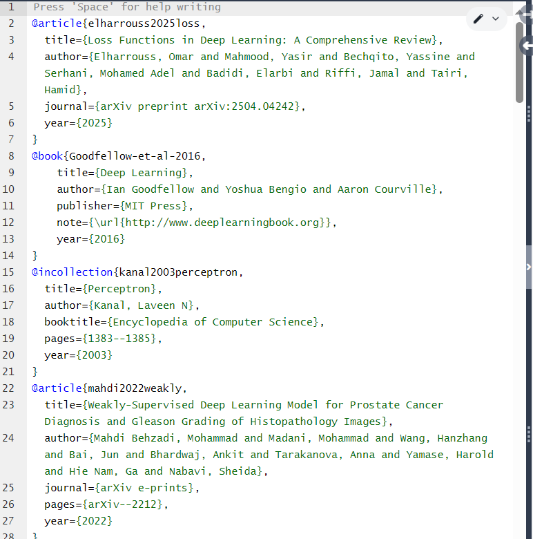
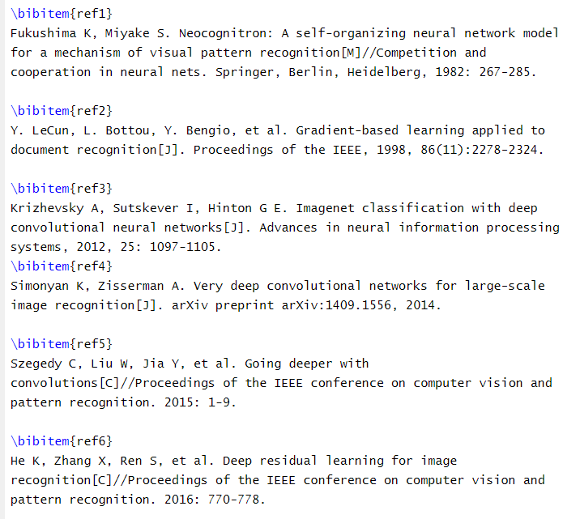
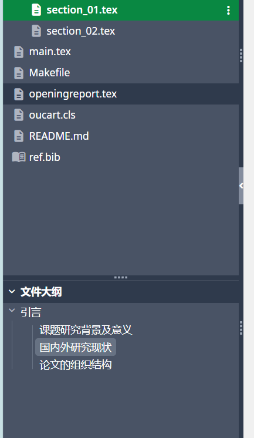
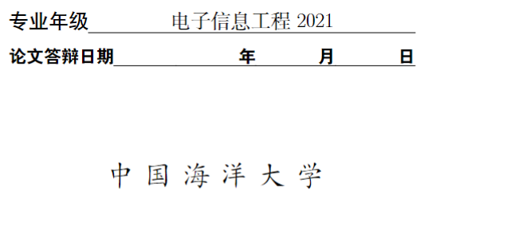

## 开头说明

一、该模板适用于✔：

- 有LaTeX基础的同学，你们应该能马上理解我说的所有东西然后立马享受到该模板的方便，但**同时我也在此请求你们能够继续改进我的模板并且秉承利好后人的开源精神！**

  **（注：改进的时候，尽量不要去大改最终的PDF效果，因为学校对论文格式是有一些硬性规定的，当前编译出的PDF效果是符合规定且答辩通过的，如果把格式大改后论文不符合要求责任自负**）

- 或者自我动手学习能力较强的同学，你们一定也可以很快上手，因为说实话overleaf就是没啥难度的。

✘ ！✘ ！✘ ！对于无脑伸手党，想着能够什么代码都不用自己写的、手把手帮你编译的，请自动绕路……真心建议还是用word写吧。

二、该模板主要是使用overleaf编译（ "Compiler" 选择 "XeLaTeX"），对于本地编译的情况可能会有出入。

## 简介

本模板是本人在毕设论文撰写期间对高峰老师：[中国海洋大学本科毕设Latex模板: 中国海洋大学本科毕设Latex模板，与Github保持同步：https://github.com/oucailab/OUC-LaTex-bachelor (gitee.com)](https://gitee.com/gaopursuit/OUC-Latex-bachelor)的一个改进版。

项目文件中的**“原README”就是高峰老师原模板的readme**，里面涉及一些本地运行的知识，供参考。

**我的主要改进之处有：**

1. 改进了论文的引用方式：

   通过建立“ref.bib”文件来统一存放所有可能用到的引用文献并且不需要手动编号排列顺序，如下图所示这些文献引用格式的顺序可以随便乱放。（注意是可能用到的，你完全可以把可能有用文献的bibtex全部丢进去，写文章的时候要用到的地方就cite一下就好。          

   ​                                                                   

   我觉得这样可以充分发挥LaTeX的写作优势，这一功能在原来的模板是没有的（如下图所示，原模版需要自己手动排列引用文献出现的顺序，我当时觉得非常麻烦，只要你正文中引用文献的顺序一改变后面的reference里的排列顺序也必须要改动，不胜其烦……这是让我产生动手改进的一大动机）

   

2. overleaf左侧栏目录生成（最终生成的PDF也会自动生成大纲目录）

   

3. 编译出的PDF引用可以自动跳转到reference对应位置；

4. 其他的一些bug…记不清了hh

## 如何使用

### Overleaf编译

**本模板在 Overleaf 下测试通过。** 可以通过链接：https://cn.overleaf.com/read/wwbzzphwvnhg#becb5b  在线浏览本项目。

“Overleaf 是一个线上 LaTeX 编辑器，可以在不安装任何工具的情况下编写 LaTeX 文档，同时也可以和其他人共享文档，共同编辑。

推荐使用 **Overleaf** 使用本模板，具体方法如下：

1. 下载模板代码，并压缩成 .zip 文件
2. 在 Overleaf 中上传这个 .zip 压缩文件以创建一个新 Overleaf 项目
3. 在 Overleaf 界面左上角点击 "Menu"
   - 选择 "Compiler" 为 "XeLaTeX"
   - 选择 "TeX Live version" 为 "2019" 或者更新的版本
4. 使用 Overleaf 编译

最近我也在使用 TexPage （https://www.texpage.com/），可以理解为国产版的 Overleaf，对于国内用户支持的要好一些，尤其是云盘同步功能，支持百度网盘和 WebDAV 。另外，遇到问题客服也很给力，发邮件能够12小时以内及时回复帮忙解决问题，大家可以考虑。”  ——**内容来源于原项目的readme**，其全部内容详见项目文件中的**“原README.md”**

### 文件结构&说明

.
├── assets**（存放各种页面样式）**
│   ├── abstractkeywords.sty
│   ├── cover.sty**（封面样式）**
│   ├── coveror.sty
│   ├── logo.eps
│   └── signature.sty
├── figures**（存放所有的图片）**
├── includes **（每一章分开写）**
│   ├── section_01.tex 
│   └── section_02.tex
├── main.tex
├── Makefile
├── openingreport.tex
├── oucart.cls
├── README.md
├── ref.bib **（所有引用文献的bibtex丢进这里）**
└── 原README.md

## 不足之处（待改进

1. **线下编译&编译时长优化**，本项目当时主要是在overleaf上运行，有时候可能图片多一点、2/30页的时候每次编译会有点卡；有能力的同学可以尝试优化整体代码（比如删掉一些package）或者是试一试线下编译方案；

2. 对于编译出的PDF，大纲中的“reference”无法准确跳转到对应的页面；

3. 封面最后一行的字体有错误，目前这么做主要是为了和上面那一行对齐，这个调试了挺久也没有弄好，隧弃（当然这一处也没人去关注，不影响答辩结果，主要是美观问题）；

   

## 一些经验分享

1. 充分使用AI写代码的能力来调试格式；常用prompt比如：帮我生成一个三维表LaTeX代码（其他的可以多多脑洞）；
2. 感觉本科毕设答辩不需要什么创新点，只要整体文章内容架构正确、格式正确、实验还算过得去，基本都给过；
3. 希望其他大佬（比如@Ngaizean）继续补充：

## 开源许可

本项目代码基于 MIT 协议开源

学校标志的版权归中国海洋大学所有

